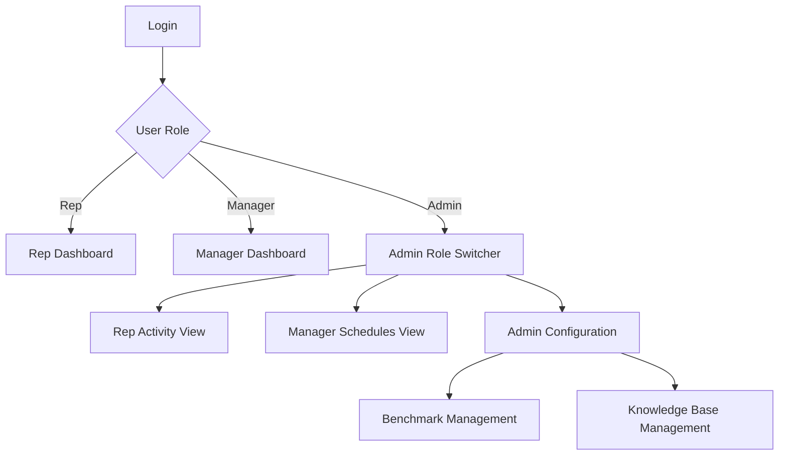

# Role-Based System Quick Guide

This guide explains who sees what in the app, and how Admin Configuration works for Benchmark and Knowledge Base (KB).

## 1) Access Overview

| Role | Main View | What they can see |
|---|---|---|
| Rep | Rep Dashboard | Only their own calls and their own today schedule |
| Manager | Manager Dashboard | Team-wide calls and all reps' today schedules |
| Admin | Admin Role Switcher | Rep Activity, Manager Schedules, and Admin Configuration |

## 2) View Flow (Diagram)



## 3) Admin Configuration

Admin Configuration has two sections:

### A) Benchmark Management

What is Benchmark?
- Benchmark is an approved best-practice call used as a reference for AI coaching and scoring.

How to add Benchmark
1. Select a call in Benchmark Management.
2. Add title and notes (optional but recommended).
3. Click Save Benchmark.

How it is used
- During AI agent analysis, the system loads approved benchmark calls for that rep.
- AI compares current call behavior against benchmark patterns and gives gap-based feedback.

### B) Knowledge Base (KB) Management

What is KB?
- KB is your internal playbook/SOP/FAQ/script content used by semantic search in chat.

How to add KB
1. Fill title, type, category, tags.
2. Paste content.
3. Click Upload to Knowledge Base.

What happens in background
- Document is saved.
- Content is chunked.
- Embeddings are generated.
- Chunks are indexed for semantic retrieval.

How KB is used
- In Company GPT chat, user question triggers semantic search on KB chunks.
- Relevant snippets are injected into AI context.
- AI answer shows references section (References from playbook).
-
## 4) KB History: Edit and Delete

Admin can manage old KB documents from KB history:
- Edit: updates document fields and refreshes embeddings.
- Delete: removes document and related chunks.
- Double-click protection: action buttons are locked while processing.

## 5) Recommended Usage

- Keep benchmark calls high quality and role-specific.
- Keep KB documents short, structured, and clear.
- Use tags and category consistently for better retrieval quality.
- Test with real chat prompts after every KB update.

## 6) Quick Validation Checklist

1. Login as Rep: verify only own schedule appears.
2. Login as Manager: verify all reps' today schedule appears.
3. Login as Admin: verify 3 views are available.
4. Add one benchmark and one KB doc.
5. Ask Company GPT a KB-related question and verify references appear.

## 7) Example KB Usage (Real Test)

### KB Document Entered

- Title: `Discovery Call Playbook v1`
- Type: `playbook`
- Category: `discovery`
- Tags: `discovery, spin, bant, objection`

Content used:

```text
Use this flow in discovery calls:
Open with agenda and timebox (20-30 mins).
Ask 3 SPIN questions:
Situation: “How do you handle this process today?”
Problem: “What is the biggest bottleneck?”
Implication: “What happens if this continues for 6 months?”
Confirm BANT:
Budget range
Decision maker
Need priority
Timeline
Handle price objection:
Acknowledge concern
Quantify business impact
Offer phased rollout
Close with a concrete next step:
Date/time for demo
Stakeholders to invite
Success criteria for next meeting.
```

### Chat Prompt Used

```text
How should I run a discovery call with SPIN and BANT?
```

### AI Output (Observed)

```text
To effectively run a discovery call using the SPIN and BANT methodologies, follow this structured approach outlined in the Discovery Call Playbook v1:

1. Open with Agenda and Timebox
2. SPIN Questions (Situation, Problem, Implication)
3. Confirm BANT (Budget, Decision Maker, Need Priority, Timeline)
4. Handle Price Objections

📚 References from playbook:
• 1. Discovery Call Playbook v1
```

Result:
- KB retrieval is working.
- The assistant used uploaded playbook content.
- The references block is visible in the final response.
